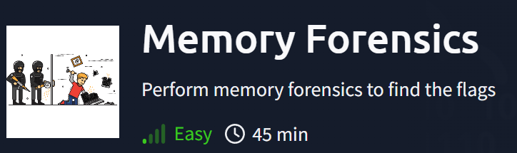
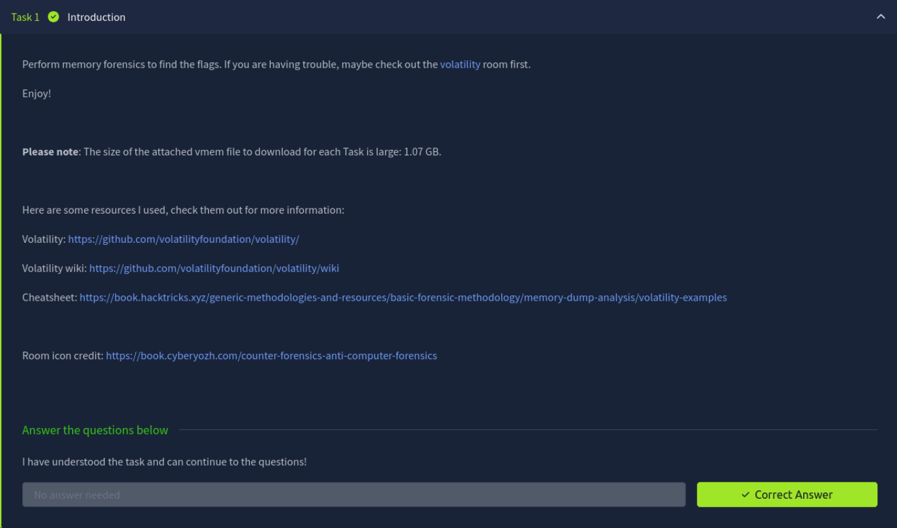
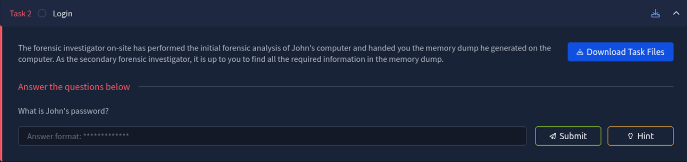
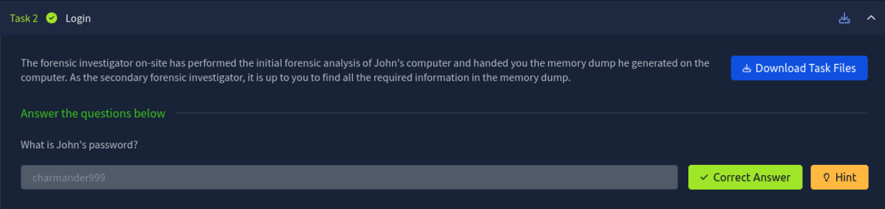
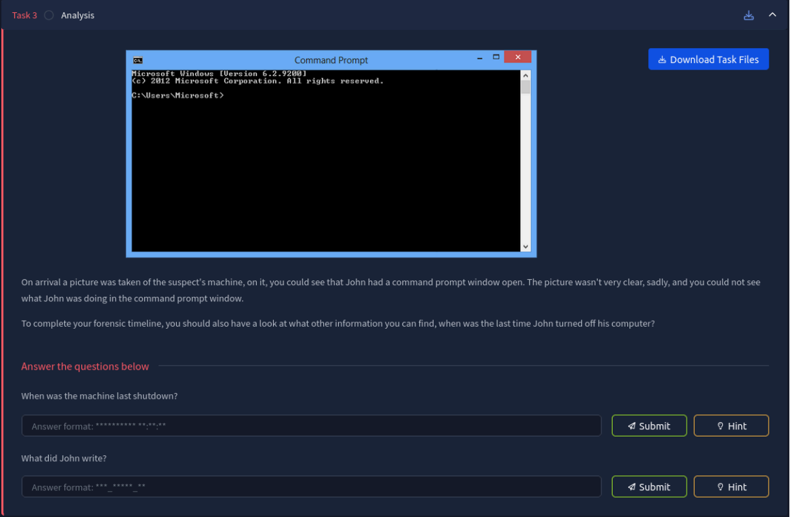
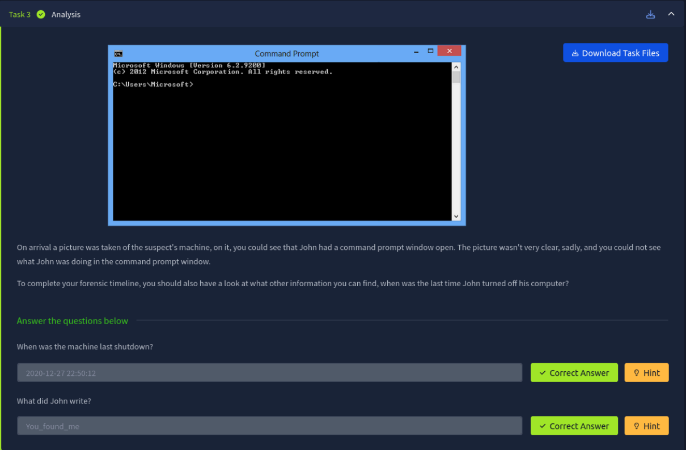
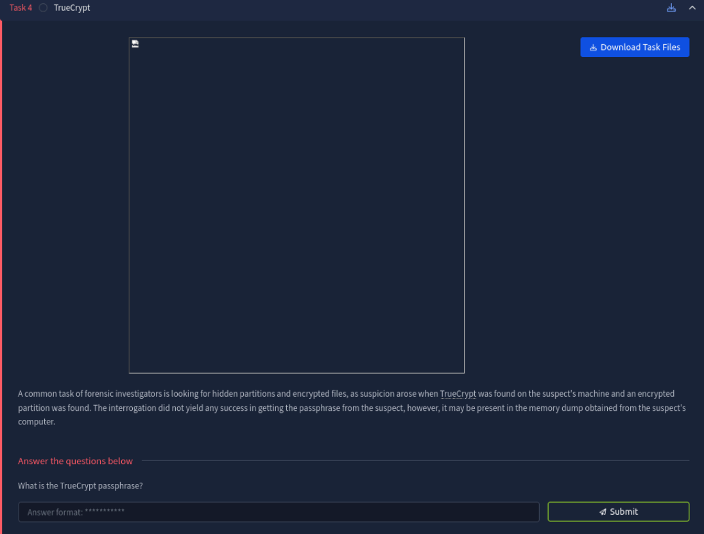
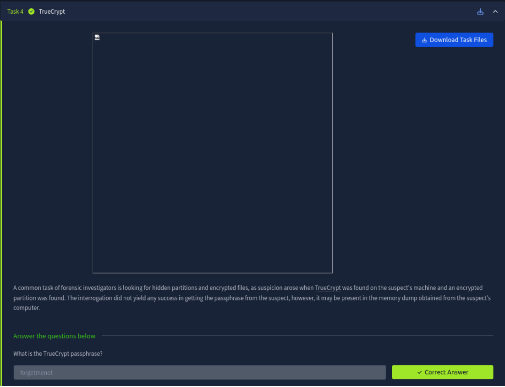
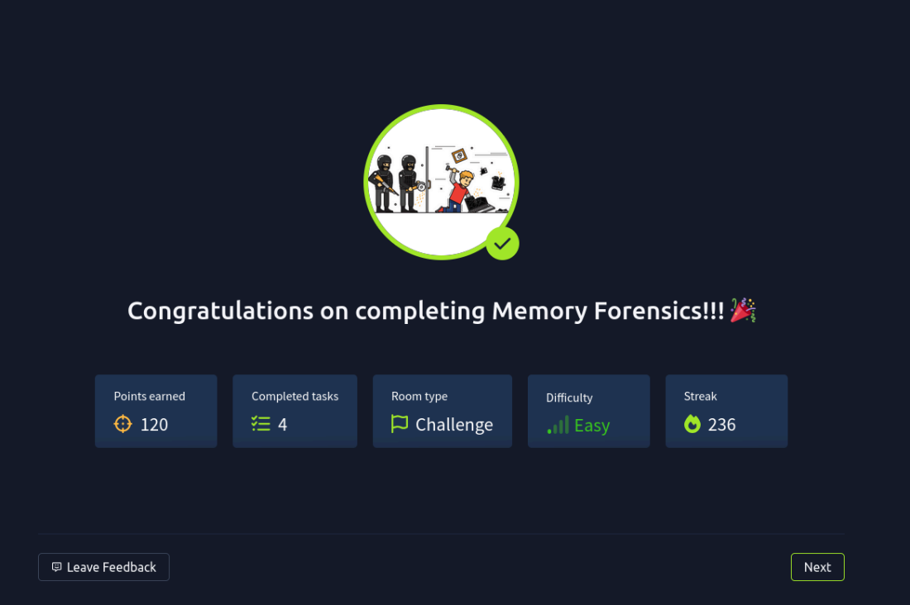

# Memory Forensics


Challenge URL: [here](https://tryhackme.com/room/memoryforensics)

## Task 1: Introduction



Firstly I navigated to the official Volatility Github page to access the repository: <br>
https://github.com/volatilityfoundation/volatility

Next, I cloned the repository to my local machine using Git. Here’s the command I used:
```bash
┌──(kali㉿kali)-[~]
└─$ git clone https://github.com/volatilityfoundation/volatility.git
```

Once the cloning process was complete, I changed into the
volatility directory to begin the setup and further analysis:

```bash
┌──(kali㉿kali)-[~]
└─$ cd volatility
```

After navigating into the cloned volatility directory, I ran the following command to check if Volatility was
working properly and to list the available options and plugins:

```bash
┌──(kali㉿kali)-[~/volatility]
└─$ python2 vol.py -h
```

This successfully displayed the help menu, confirming that Volatility was installed correctly. However, I
encountered several import errors related to missing dependencies such as Crypto.Hash and distorm3.
These are common with a fresh install and can be fixed by installing the required packages. 

For example, to resolve the missing dependencies, I installed them using: <br>
pip2 install pycryptodome <br>
pip2 install distorm3 

Once the dependencies were installed, I re-ran the help command and was ready to start analyzing the
memory image. 

# Task 2: Login


I downloaded the memory snapshot file Snapshot6_1609157562389.vmem and placed it in my local
Volatility directory. To identify the correct profile for further analysis, I then ran the following command:

```bash
┌──(kali㉿kali)-[~/volatility]
└─$ python2 vol.py imageinfo -f Snapshot6_1609157562389.vmem
Volatility Foundation Volatility Framework 2.6.1
INFO : volatility.debug : Determining profile based on KDBG search...
Suggested Profile(s) : Win7SP1x64, Win7SP0x64, Win2008R2SP0x64, Win2008R2SP1x64_24000,
Win2008R2SP1x64_23418, Win2008R2SP1x64, Win7SP1x64_24000, Win7SP1x64_23418
AS Layer1 : WindowsAMD64PagedMemory (Kernel AS)
AS Layer2 : FileAddressSpace (/home/kali/volatility/Snapshot6_1609157562389.vmem)
PAE type : No PAE
DTB : 0x187000L
KDBG : 0xf80002c4a0a0L
Number of Processors : 1
Image Type (Service Pack) : 1
KPCR for CPU 0 : 0xfffff80002c4bd00L
KUSER_SHARED_DATA : 0xfffff78000000000L
Image date and time : 2020-12-27 06:20:05 UTC+0000
Image local date and time : 2020-12-26 22:20:05 -0800
```

Next, I tried using the Win7SP1x64 profile to extract password hashes with the hashdump plugin:

```bash
┌──(kali㉿kali)-[~/volatility]
└─$ python2 vol.py --profile Win7SP1x64 hashdump -f Snapshot6_1609157562389.vmem
Volatility Foundation Volatility Framework 2.6.1
Administrator:500:aad3b435b51404eeaad3b435b51404ee:31d6cfe0d16ae931b73c59d7e0c089c0:::
Guest:501:aad3b435b51404eeaad3b435b51404ee:31d6cfe0d16ae931b73c59d7e0c089c0:::
John:1001:aad3b435b51404eeaad3b435b51404ee:47fbd6536d7868c873d5ea455f2fc0c9:::
HomeGroupUser$:1002:aad3b435b51404eeaad3b435b51404ee:91c34c06b7988e216c3bfeb9530cabfb:::
```
I saved the NTLM hash for the John user to a file named john.txt:

```bash
┌──(kali㉿kali)-[~]
└─$echo "John:1001:aad3b435b51404eeaad3b435b51404ee:47fbd6536d7868c873d5ea455f2fc0c9:::" > john.txt
```

Then, I used John the Ripper with the rockyou.txt wordlist to crack the hash:

```bash
┌──(kali㉿kali)-[~]
└─$ john --wordlist=/usr/share/wordlists/rockyou.txt --format=nt john.txt
Using default input encoding: UTF-8
Loaded 1 password hash (NT [MD4 128/128 AVX 4x3])
Warning: no OpenMP support for this hash type, consider --fork=4
Press 'q' or Ctrl-C to abort, almost any other key for status
charmander999 (John)
1g 0:00:00:00 DONE (2025-04-22 16:53) 1.408g/s 12930Kp/s 12930Kc/s 12930KC/s
charmcez..charmaise
Use the "--show --format=NT" options to display all of the cracked passwords reliably
Session completed.
```


## Task 3: Analysis


I downloaded the memory snapshot file Snapshot19_1609159453792.vmem and placed it in my local
Volatility directory. To identify the correct profile for further analysis, I then ran the following command:

```bash
┌──(kali㉿kali)-[~/volatility]
└─$ python2
vol.py imageinfo -f Snapshot19_1609159453792.vmem
Volatility Foundation Volatility Framework 2.6.1
INFO : volatility.debug : Determining profile based on KDBG search...
Suggested Profile(s) : Win7SP1x64, Win7SP0x64, Win2008R2SP0x64, Win2008R2SP1x64_24000,
Win2008R2SP1x64_23418, Win2008R2SP1x64, Win7SP1x64_24000, Win7SP1x64_23418
AS Layer1 : WindowsAMD64PagedMemory (Kernel AS)
AS Layer2 : FileAddressSpace (/home/kali/volatility/Snapshot19_1609159453792.vmem)
PAE type : No PAE
DTB : 0x187000L
KDBG : 0xf80002bfd0a0L
Number of Processors : 1
Image Type (Service Pack) : 1
KPCR for CPU 0 : 0xfffff80002bfed00L
KUSER_SHARED_DATA : 0xfffff78000000000L
Image date and time : 2020-12-27 23:06:01 UTC+0000
Image local date and time : 2020-12-28 00:06:01 +0100
```

I used the following command to determine the last shutdown time of the machine:

```bash
┌──(kali㉿kali)-[~/volatility]
└─$ python2 vol.py --profile Win7SP1x64 shutdowntime -f Snapshot19_1609159453792.vmem
Volatility Foundation Volatility Framework 2.6.1
Registry: SYSTEM
Key Path: ControlSet001\Control\Windows
Key Last updated: 2020-12-27 22:50:12 UTC+0000
Value Name: ShutdownTime
Value: 2020-12-27 22:50:12 UTC+0000
```

I used the consoles to view John’s command line activity:

```bash
┌──(kali㉿kali)-[~/volatility]
└─$ python2 vol.py --profile Win7SP1x64 consoles -f Snapshot19_1609159453792.vmem
Volatility Foundation Volatility Framework 2.6.1
ConsoleProcess: conhost.exe Pid: 2488
Console: 0xffa66200 CommandHistorySize: 50
HistoryBufferCount: 1 HistoryBufferMax: 4
OriginalTitle: %SystemRoot%\System32\cmd.exe
Title: Administrator: C:\Windows\System32\cmd.exe
AttachedProcess: cmd.exe Pid: 1920 Handle: 0x60
CommandHistory: 0x21e9c0 Application: cmd.exe Flags: Allocated, Reset
CommandCount: 7 LastAdded: 6 LastDisplayed: 6
FirstCommand: 0 CommandCountMax: 50
ProcessHandle: 0x60
Cmd #0 at 0x1fe3a0: cd /
Cmd #1 at 0x1f78b0: echo THM{You_found_me} > test.txt
Cmd #2 at 0x21dcf0: cls
Cmd #3 at 0x1fe3c0: cd /Users
Cmd #4 at 0x1fe3e0: cd /John
Cmd #5 at 0x21db30: dir
Cmd #6 at 0x1fe400: cd John
Screen 0x200f70 X:80 Y:300
Dump:
C:\>cd /Users
C:\Users>cd /John
The system cannot find the path specified.
C:\Users>dir
Volume in drive C has no label.
Volume Serial Number is 1602-421F
Directory of C:\Users
12/27/2020 02:20 AM <DIR> .
12/27/2020 02:20 AM <DIR> ..
12/27/2020 02:21 AM <DIR> John
04/12/2011 08:45 AM <DIR> Public
0 File(s) 0 bytes
4 Dir(s) 54,565,433,344 bytes free
C:\Users>cd John
C:\Users\John>
```



## Task 4: TrueCrypt


I downloaded the memory snapshot file Snapshot14_1609164553061.vmem and placed it in my local
Volatility directory. To identify the correct profile for further analysis, I then ran the following command:

```bash
┌──(kali㉿kali)-[~/volatility]
└─$ python2 vol.py imageinfo -f Snapshot14_1609164553061.vmem
Volatility Foundation Volatility Framework 2.6.1
INFO : volatility.debug : Determining profile based on KDBG search...
Suggested Profile(s) : Win7SP1x64, Win7SP0x64, Win2008R2SP0x64, Win2008R2SP1x64_24000,
Win2008R2SP1x64_23418, Win2008R2SP1x64, Win7SP1x64_24000, Win7SP1x64_23418
AS Layer1 : WindowsAMD64PagedMemory (Kernel AS)
AS Layer2 : FileAddressSpace (/home/kali/volatility/Snapshot14_1609164553061.vmem)
PAE type : No PAE
DTB : 0x187000L
KDBG : 0xf80002c4d0a0L
Number of Processors : 1
Image Type (Service Pack) : 1
KPCR for CPU 0 : 0xfffff80002c4ed00L
KUSER_SHARED_DATA : 0xfffff78000000000L
Image date and time : 2020-12-27 13:41:31 UTC+0000
Image local date and time : 2020-12-27 05:41:31 -0800
```

To find the TrueCrypt passphrase, I used the truecryptpassphrase plugin:

```bash
┌──(kali㉿kali)-[~/volatility]
└─$ python2 vol.py --profile Win7SP1x64 truecryptpassphrase -f Snapshot14_1609164553061.vmem
Volatility Foundation Volatility Framework 2.6.1
Found at 0xfffff8800512bee4 length 11: forgetmenot
```



This challenge was straightforward, fun to complete, and gave me a great hands-on feel for memory
forensics.

